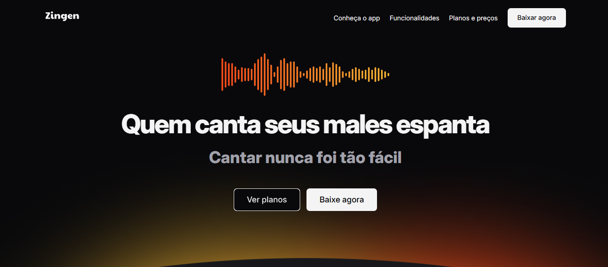
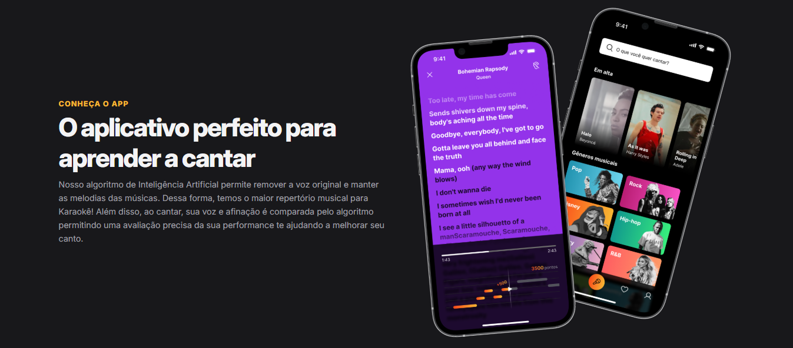
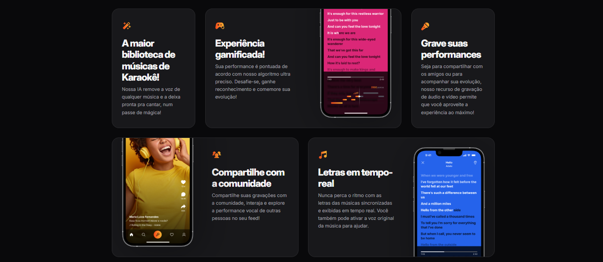
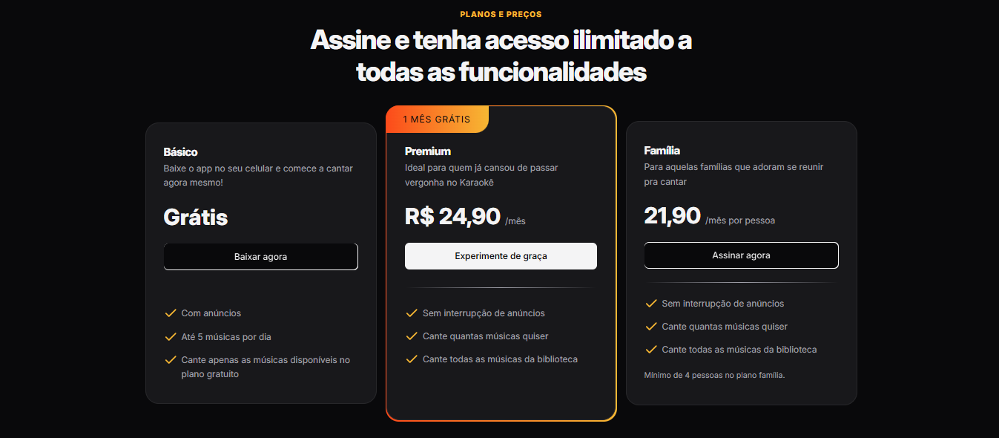

# 🎤 Zingen - O aplicativo perfeito para aprender a cantar

Site **front-end** apresentando um aplicativo de karaokê com IA e suas funcionalidades que foi desenvolvido com HTML e CSS.

## ✨ Destaques do Projeto
- 🎶 **Seção de onboarding** com chamada para ação intuitiva
- 🤖 **Seção de recursos** destacando a tecnologia de IA vocal
- 💎 **Seção de planos** com comparação de assinaturas
- 📲 **Design responsivo** simulando interface mobile

## 🛠️ Tecnologias usadas

  
  

## 🎨 Preview

  
  
  
  

## 🌐 Acesso ao Projeto

🔍 **Todos os meus projetos**: [github.com/luizacavalcantee](https://github.com/luizacavalcantee)  
💌 **Contato**: cavalcanteluiza13@gmail.com | [LinkedIn](https://www.linkedin.com/in/luizacavalcanteee/)
